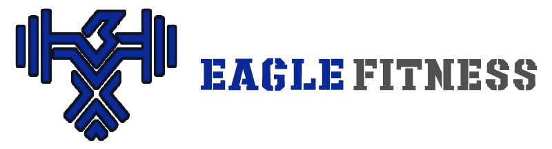

<div  id="top"><div>

<!--

*** README for the FITNESS APP 

-->

  

<!-- Project Shields -->

  

 

[](https://opensource.org/licenses/MIT)

  

<!-- Project Logo -->

<br  />

<div  align="center">

<a  href="heroku app here">



<br>Click the logo to launch APP<br>

<a/>

<h3  align="center">

Apollo Fitness
</h3>

<p  align="center">

Fitness management app for Coaches and Gyms 
 
<br  />

<a  href="https://github.com/Alexnj1/eagle-fitness">

<strong>Explore the docs</strong>

</a>

<br  />

<br  />

</div>

  

<!-- TABLE OF CONTENTS -->

<details>

<summary>Table of Contents</summary>

<ol>

<li>

<a  href="#about-the-project">About The Project</a>

</li>

<li>

<a  href="#what-was-done"> What was done</a>

</li>

<li>

<a  href="#instalation"> instalation</a>

</li>

<li>

<a  href="#usage"> usage</a>

</li>

<li>

<a  href="#contact">Contact</a>

</li>

  

</ol>

</details>

  

<!-- ABOUT THE PROJECT -->

## The Fitness tracker app

  

[![Product Name Screen Shot][product-screenshot1]](./public/assets/images/11-express-homework-demo-01.png)

  

### About the APP

A full Stack APP to track gym/trainer clients. 
This is a full stack application, hosted on heroku, that utilizes Node.js, Express.js, MongoDB, various NPM packages and various full stack web development concepts to create a fitness trakcer style website. 

 

### What it Does

```md

Have a website where clients can track their worekout in a calendar. have a proficle, statictics and meal plans  


```
  

###  what was used 

  

Created a site following the parameter set by the user, used Javascript as my main language and node to make the app. mongoDB is the main database of the site and REACT to make this a single page site. 

  

App build in:
 
     
     
   


  

### Instalation

Run this app directly from our [Heroku deployment](https://agile-tor-98669.herokuapp.com/)  
If you want your own:

 1. Fork
 2. Clone
 3. install nodejs & and mongoDB
 4. in the root directory run:  `npm i` then `npm run seed`
 5. then run: `npm start`
 6. go to localhost:3001
 7. ENJOY!

  

### Usage

  

Run the following from the directory where you have downloaded the repo.

  

```

  

npm i && npm run seed

npm start

  

```

  

this is only if you want to run this in your own deployment. the live app is currently deployed on heroku.

 

-------------------------

Thank you for taking time looking at this page.

  

Happy painting!

  

<p  align="right">(<a  href="#top">back to top</a>)</p>

  

<!-- CONTACT -->

## Done By

  
### Alex Noble-James
### Megan Campbell
### James Compagnoni
### Abraham Aguirre  


Project Link: [https://github.com/Alexnj1/eagle-fitness](https://github.com/Alexnj1/eagle-fitness)

  

<!-- MARKDOWN LINKS & IMAGES -->

[product-screenshot1]: ./client/public/images/screenshot_1.png


